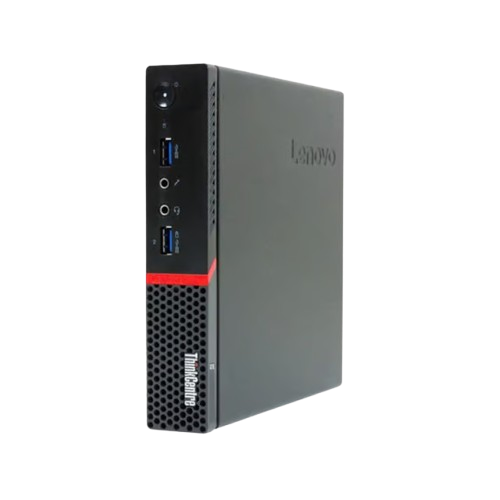

# Boutrik's Dotfiles

Welcome to my personal `dotfiles` repository.  
This repo contains the configuration files and environment setup for all my machines. Each setup is carefully tuned to match its use case.

## Architecture

My infrastructure is built around a centralized home server connecting to mobile clients via a secure mesh network.

```text
            .----------------------------------.
	    	|	   ThinkCentre M710q Tiny	   |
		    |          [ OpenBSD 🐡 ]          |
		    |								   |
	    	|	.---------.	 .-------------.   |
			|	| Forgejo |	 | VaultWarden |   |
			|	|  (Git)  |	 | (Passwords) |   |
			|	'----+----'	 '------+------'   |
			'--------+--------------+----------'
					 |				|
					 v				v
	.==================================================.
	(		   	TAILSCALE MESH NETWORK			   )
	'=================================================='
		  ^					 ^					  ^
		  |					 |					  |
   [Git <Webhook>]	  [Git <Webhook>]		   [Sync]
          |					 |					  |
  		  |					 |					  |
  .-------+-------. .--------+---------.   .------+------.
  | Thinkpad T480 |	| Dell Rugged 5424 |   |  Pixel 8a   |
  |  [ NixOS  ]  | |   [ NixOS  ]    |   | [ Android ] |
  |---------------|	|------------------|   |-------------|
  | /etc/nixos    |	| /etc/nixos	   |   | BitWarden   |
  | (Dotfiles)	  | | (Dotfiles)	   |   | Client      |
  '---------------' '------------------'   '-------------'
```

This setup relies on a `Tailscale` mesh network to securely connect devices regardless of their physical location. The T480 and D5424 both synchonize their system configurations (/etc/nixos) via Git webhooks (through Forgejo).

## Lenovo ThinkPad T480 \& Dell Rugged 5424

<div align="center">


</div>

<br>

These machines are my daily driver, used for general productivity, programming, browsing and writing. They feature a dual battery system (therefore hot-swappable) and USB-C charging.

### Hardware

| Specification  | T480 | D5424 |
|:---------------|:-----|:------|
| **Processor**  | i5-8350u (4 cores, 8 threads) 1.7-3.6 GHz | - |
| **GPU**        | UHD Graphics 620 (~ 0.44 TFLOPS) | - |
| **Memory**     | 8 GiB DDR4 2400 MHz | - |
| **Disk**       | Liteon CV8-CE128 [w=8.6 GiB/s r=7.7 GiB/s] | - |
| **Display**    | 14" FHD 1920x1080 60Hz | - |
| **Battery**    | SANYO 01AV419 24 Wh 68.1% (16.4 Wh) | - |

### Operating System

They run `NixOS`, customized with a strong emphasis on security and privacy. The configuration is declarative, minimal, and tailored for my personal workflow.

For encryption, because it has a mobile usage (e.g., university or travel), FDE is implemented using `LUKS2` with `AES-XTS` (AES-NI), `whirlpool` for hashing, and `argon2(id)` as the KDF. Plausible deniability is under consideration but not yet implemented.

#### Environment

- **Bootloader**: `systemd-boot`
- **Libc/toolchain**: `glibc`, `gcc`, `llvm/clang`
- **Filesystem**: `ext4`
- **Window manager**: `hyprland`
- **Status bar**: `waybar`
- **Display manager**: `lightdm`
- **Application launcher**: `wofi`
- **Terminal**: `alacritty` with `bash`
- **Browser**: `firefox`
- **Editor**: `neovim`, `texstudio`, `marktext`

## Acer Nitro 5 AN515-58-58W3

<div align="center">

</div>

<br>

The Nitro is the most powerful machine I own (for now), primarily used for gaming and resource-intensive development such as Android Studio, heavy compilation and other demanding environments.

### Hardware

| Component      | Specification |
|:---------------|:--------------|
| **Processor**  | i5-12450H (8 cores, 12 threads) 2.0-4.4 GHz |
| **GPU**        | RTX 3050 Mobile (~ 4.33 TFLOPS) |
| **Memory**     | 8+8 GiB DDR4 3200 MHz |
| **Disk I**     | SSTC CL1-4D256 [w=7.8 GiB/s r=10.6 GiB/s] |
| **Disk II**    | Micron 3400 MTFDKBA512TFH [w=1.9 GiB/s r=4.3 GiB/s] |
| **Display**    | 15.6" FHD 1920x1080 144Hz |
| **Battery**    | SMP AP18E7M 58.8 Wh 74.0% (43.5 Wh) |

### Operating System

I run a custom `Gentoo` setup, customized for performance. It also dual-boots with `Windows`, which I use for gaming and sofwares that are Windows-only.

#### Environment

- **Bootloader**: `grub`, EFI
- **Init system**: `openrc`
- **Libc/toolchain**: `glibc`, `gcc`, `llvm/clang`
- **Filesystem**: `btrfs`
- **Window manager**: `i3wm`
- **Status bar**: `polybar`
- **Screen lock**: `xsecurelock`
- **Application launcher**: `dmenu`
- **Terminal**: `alacritty` with `bash`
- **Browser**: `firefox`

## Lenovo ThinkCentre M700 Tiny

<div align="center">

</div>

<br>

This machine operates as my homeserver, managing self-hosted services and data synchronization.

### Hardware

| Component      | Specification |
|:---------------|:--------------|
| **Processor**  | i5-6400T |
| **Memory**     | 8 GiB |

### Operating System & Environment

The server runs `OpenBSD`. It is configured to run services (e.g. Forgejo, VaultWarden) within a secure environment.

## License

This project is licensed under the [MIT License](https://opensource.org/licenses/MIT). Feel free to use, modify, and distribute the code as needed. See the [LICENSE](LICENSE) file for more information.
