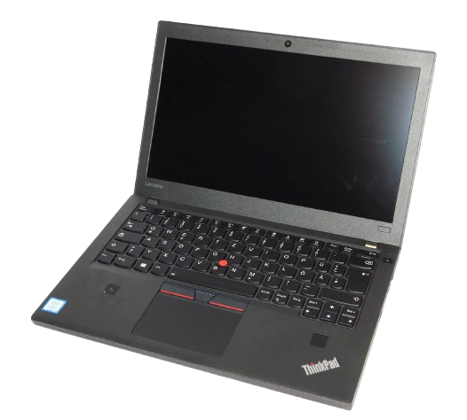
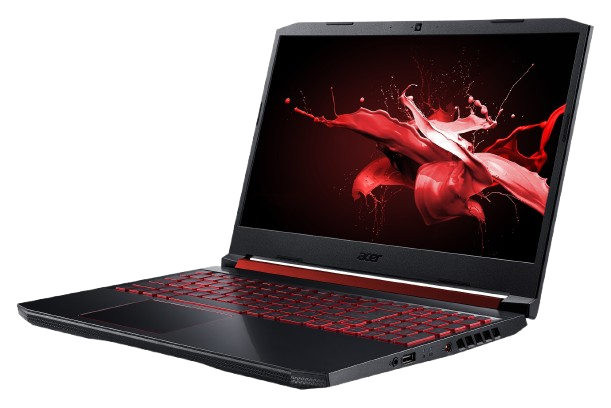
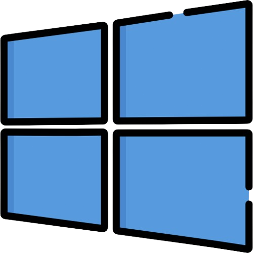
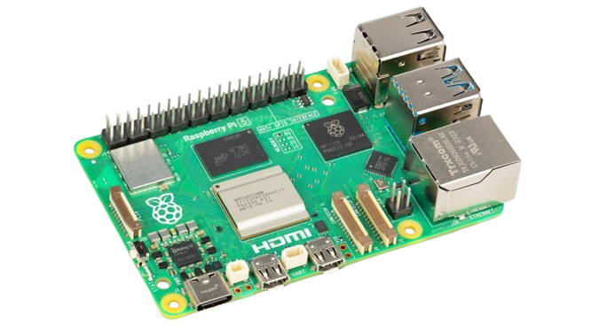

# Boutrik's Dotfiles

Welcome to my personal `dotfiles` repository.  
This repo contains the configuration files and environment setup for all my machines. Each setup is carefully tuned to match its use case.

## Lenovo ThinkPad X270 & T480

These two machines are my daily drivers, used for general productivity, programming and writing. Both feature dual battery system (hot-swappable) and USB-C charging capabilities.

### X270 Hardware

| Component      | Specification |
|:---------------|:--------------|
| **Processor**  | i5-6300u (2 cores, 4 threads) 2.4-3.0 GHz |
| **GPU**        | HD Graphics 520 (~ 0.38 TFLOPS) |
| **Display**    | 12.5" FHD 1920x1080 60Hz |

### T480 Hardware

| Component      | Specification |
|:---------------|:--------------|
| **Processor**  | i5-8350u (4 cores, 8 threads) 1.7-3.6 GHz |
| **GPU**        | UHD Graphics 620 (~ 0.44 TFLOPS) |
| **Memory**     | 8 GiB DDR4 2400 MHz |
| **Disk**       | Liteon CV8-CE128 [w=8.6 GiB/s r=7.7 GiB/s]
| **Display**    | 14" FHD 1920x1080 60Hz |
| **Battery**    | SANYO 01AV419 24 Wh 68.1% (16.4 Wh) |

### Operating System

Both run `NixOS` , customized with a strong emphasis on security and privacy. The configuration is declarative, minimal, and tailored for my personal workflow.

#### Encryption

For mobile use (e.g., university or travel), FDE is implemented using `LUKS2` with `AES-XTS` (AES-NI), `whirlpool` for hashing, and `argon2(id)` as the KDF. Plausible deniability is under consideration but not yet implemented.

#### Environment

- **Bootloader**: `systemd-boot`
- **Libc/toolchain**: `glibc`, `gcc`, `llvm/clang`
- **Filesystem**: `ext4`
- **Window manager**: `hyprland`
- **Status bar**: `waybar`
- **Display manager**: `lightdm`
- **Application launcher**: `rofi`
- **Terminal**: `alacritty` with `bash`
- **Browser**: `firefox`

## Acer Nitro 5 AN515-58-58W3

The Nitro is my more powerful machine, primarily used for gaming and resource-intensive development such, as Android Studio and other demanding environments.

### Hardware

| Component      | Specification |
|:---------------|:--------------|
| **Processor**  | i5-12450H (8 cores, 12 threads) 2.0-4.4 GHz |
| **GPU**        | RTX 3050 Mobile (~ 4.33 TFLOPS) |
| **Memory**     | 8+8 GiB DDR4 3200 MHz |
| **Disk I**     | SSTC CL1-4D256 [w=7.8 GiB/s r=10.6 GiB/s] |
| **Disk II**    | Micron 3400 MTFDKBA512TFH [w=1.9 GiB/s r=4.3 GiB/s] |
| **Display**    | 15.6" FHD 1920x1080 144Hz |
| **Battery**    | SMP AP18E7M 58.8 Wh 74.0% (43.5 Wh) |

### Operating System

I run a custom `Gentoo`  setup, customized for performance. It also dual-boots with `Windows` , which I use for gaming and sofwares that are Windows-only.

#### Encryption

FDE is implemented using `LUKS2` with `AES-XTS` (AES-NI), `SHA-512` for hashing, and `PBKDF2` as the KDF.

#### Environment

- **Bootloader**: `grub`, EFI
- **Init system**: `openrc`
- **Libc/toolchain**: `glibc`, `gcc`, `llvm/clang`
- **Filesystem**: `btrfs`
- **Window manager**: `i3wm`
- **Status bar**: `polybar`
- **Screen lock**: `xsecurelock`
- **Application launcher**: `dmenu`
- **Terminal**: `alacritty` with `bash`
- **Browser**: `firefox`

<!---
## (Planned) Raspberry Pi 5

The Rpi is a future addition to my setup, intended to be used as an home server.

I'm still undecided on which operating system to run. Options under consideration include: `OpenBSD`, `Ubuntu Server` and `NixOS`. Once the setup is finalized, it's dotfiles and configuration will be added to this repository under a dedicated `rpi-5` directory.

### Hardware

| Component      | Specification |
|:---------------|:--------------|
| **Processor**  | BCM2712 (4 cores) 2.4 GHz |
| **GPU**        | VideoCore VII (~ 0.05 TFLOPS) |
| **RAM**        | 8 GB LPDDR4X (2133MHz) |
--->

## License

This project is licensed under the [MIT License](https://opensource.org/licenses/MIT). Feel free to use, modify, and distribute the code as needed. See the [LICENSE](LICENSE) file for more information.
